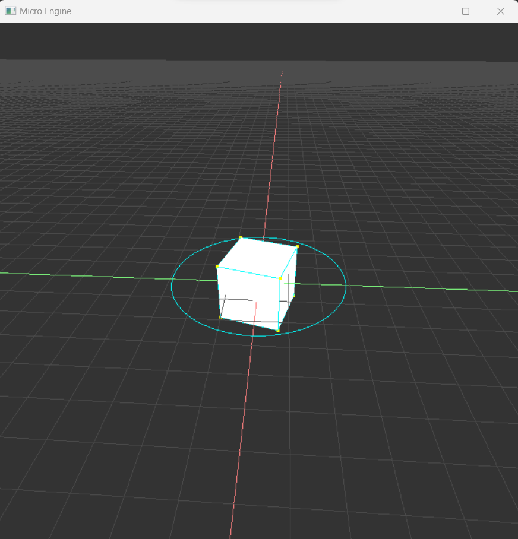
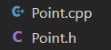
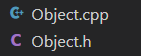
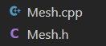

# MICRO ENGINE
#### Video Demo:	https://youtu.be/s3qogPdznPk
#### Description:
 This project was made for learning purposes and to understand more about computer graphics workflow, api usage and abstraction involving the components.

 ### Toolkit:
 * OpenGL (graphics api)
 * GLUT (setting a window and linking to opengl - creating an opengl context)
 * C++
 * Object Oriented Programming



## Why OpenGL?
OpenGL is a graphics API and what that means is that it defines pre-built functions to use your gpu and literally paint graphics on your screen. Opengl is a state machine, think of it as your gpu, it is a specification for your hardware to use your gpu and it's machine code, but in order to create a working application that draw graphics you need a window to do so. Thats where subroutines api comes in like GLEW or GLUT to handle creating a window in the current OS and setting the OpenGL context that Initializes a bunch of states for the API like version, gpu driver and as well as default framebuffer that rendering commands will draw to instead of other framebuffer object. This is the reason why you swap buffers at the end of the drawing because the rendering functions were writing in the default one, but you can have more than two frame buffer objects for other purposes.

#### Used code to set the defaults described above:
```
int main(int argc, char **argv)
{
    cout << "Micro Engine" << endl;

    glutInit(&argc, argv);
    glutInitDisplayMode(GLUT_DOUBLE | GLUT_DEPTH | GLUT_RGB);

    glutInitWindowPosition(960 - 550, 0);
    glutInitWindowSize(mainCamera.getWidth(), mainCamera.getHeight());
    glutCreateWindow("Micro Engine");

    init();

    glutDisplayFunc(render);
    glutIdleFunc(animate);
    glutReshapeFunc(reshape);
    glutKeyboardFunc(keyboard);
    glutSpecialFunc(arrow_button);
    glutMouseFunc(mouse_input);

    glutMainLoop();

    return 0;
}
```
All "glutFunctions" set some OpenGL state or receive a pointer to a fuction to handle events like input from mouse and keyboard that are probably implemented using some Windows API (in my case), but GLUT also have versions for Linux and MacOS.

##  Abstractions

## Vertices

Since computer graphics is basically all about verticies and vectors, i implemented a class called **Point** to handle vertex operations.



It uses operator overloading in C++ to **add** points, **multiply**, **subtract**, **compare** (min, max) and as well as some functions that are super useful in CG like **DotProduct()**, **CrossProduct()**, getting distances, etc.
#### Point.h
```
class Point
{

public:
    float x, y, z;
    int color;
    // Constructor
    Point();
    Point(float x, float y, float z);
    void set(float x, float y, float z);
    // Terminal debug
    void debug();
    // Simple Operations
    void multiply(float x, float y, float z);
    void add(float x, float y, float z);
    void normalize();
    // Length of a Vector
    double length();
    // Rotation
    void rotateX(float angle);
    void rotateY(float angle);
    void rotateZ(float angle);
};

// Vector Operations
Point getMax(Point P1, Point P2);
Point getMin(Point P1, Point P2);

bool operator==(Point P1, Point P2);
Point operator+(Point P1, Point P2);
Point operator-(Point P1, Point P2);
Point operator*(Point P1, float k);
Point operator-(Point P1);

Point normalize(Point vec);
double DotProd(Point v1, Point v2);
Point CrossProd(Point v1, Point v2);

int intersec2d(Point k, Point l, Point m, Point n, double &s, double &t);
bool HaInterseccao(Point k, Point l, Point m, Point n);

long int getContadorInt();
void resetContadorInt();
int lado(Point P1, Point P2, Point A);

double Distance(Point P, Point Q);
```
## Objects

The Object class defined in **Object.h** was implemented to act like a buffer for the vertices, this is due to the use of only glut that does't provide any opengl extension only subroutine managing so i only used the standard legacy functions. If wanted or needed more modern functionality i suggest you use an API for extension loading.



It's class contain definitions for drawing function with **glVertex2f** or **glVertex3f** for procedural rasterization (legacy deprecated functions) and other methods like getting bounds, vertex alteration and rotation.

#### Object.h
```
class Object
{
    vector<Point> Vertices;
    Point Min, Max;
    string name;

public:
    // Constructor
    Object();
    // Manipulation
    void put(Point);
    void put(Point p, int pos);
    string getName();
    Point getVertex(int);
    void alterVertex(int i, Point P);
    void getEdge(int i, Point &P1, Point &P2);
    unsigned long getSize();
    // Paint functions (display)
    void paintVertices(float pointSize);
    void paintWireframe();
    void paintEdges();
    void paintEdge(int n);
    void paintFaces();
    void paintTriangleStrip();
    // Terminal Debug
    void debug();
    // Limits
    void getExtremes(Point &Min, Point &Max);
    void updateExtremes();
    // Load txt Object
    void LoadObject(string filename);
    //  Transformations
    void rotationX(float deg);
    void rotationY(float deg);
    void rotationZ(float deg);
};
```
## Mesh

Mesh is a simple class that extends the Object class and it's
purpose is only to generate some shapes by calling a single function like cubes, square, circle, hexagons, etc.



#### Mesh.h
```
class Mesh : public Object
{
public:
// Shapes (generate Objects)
    void Triangle(float scale);
    void Square(float scale);
    void Pentagon(float scale);
    void Hexagon(float scale);
    void Circle(float scale);
    void Cube(float scale);
    void Arrow3d(float scale);
};
```
## World

World class only defines some variables for a virtual worldspace and drawing a grid but there is no actual limit to the world size in and of itself.


#### World.h

```
class World
{
    // Logical Limits of the World Space)
    Point Min, Max;
    // Grid size
    unsigned int GridSize;
    // World Grid
    Object WorldGrid, X_Axis, Y_Axis, Z_Axis, Cursor;
    // World basis vectors
    Point basisX, basisY, basisZ;
    // World Objects
    vector<Object> objects;

public:
    World();
    Point getMax();
    void setGridSize(float size);
    void createWorldGrid();
    void paintWorldGrid();
    Point getCursor();
    void setCursor(Point);
};
```
## Camera

Camera defines the variables for a camera like vectors for orientation and transformations and setting the viewport  for world matrix operations. The constructor set some default values for field of view, inital position, etc.


#### Camera.h

```
class Camera : public Object
{
    // Camera vecs
    Point cameraPos;
    Point cameraTarget;
    Point cameraDir;
    Point worldUp;
    Point cameraRight;
    Point cameraUp;
    // Camera settings
    float width;
    float height;
    float fov;
    float ratio;
    float zNear;
    float zFar;
    float speed;
    float sensitivity;
public:
    Camera();
    void debug();
    void setWidth(float w);
    void setHeight(float h);
    void setPerspective();
    void setViewport(float w, float h);
    void setPosition(Point new_pos);
    void setTarget(Point new_target);
    void setFov(float new_fov);
    void setRatio(float w, float h);
    void setZnear(float distance);
    void setZfar(float distance);
    void setSpeed(float new_speed);
    void setSensitivity(float new_sens);
    float getWidth();
    float getHeight();
    void lookAt();
    void lookAt(Point pos, Point target);
};
```
## MAKEFILE

The makefile defines the build setting and objects to compile using gcc (Makefile.mk).

# END


